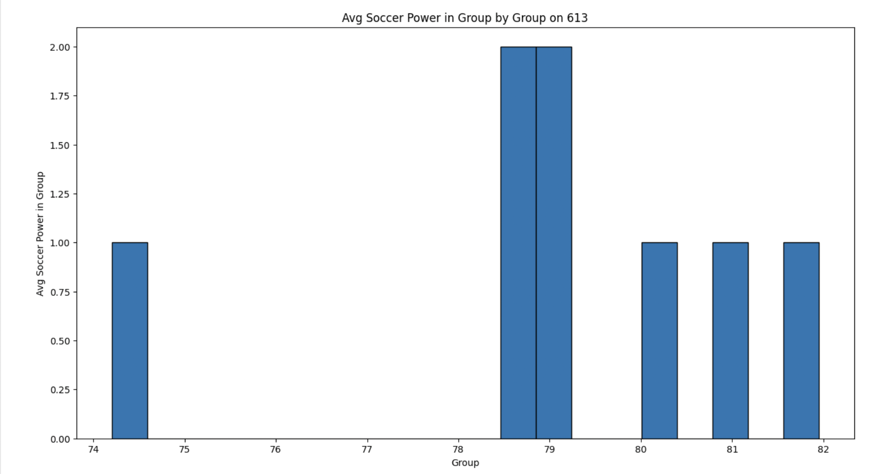

# Haochong-individual-3 
This is a repo template for course 706_Data_Engineering Individual Project 3. I use two datsets about the prediction of the world cup on 06/09 and 06/13. First of all, I define function called `extract` to get data from url. Then, use `transform_load.py` to transform data into delta lakes tables and load data. After that, I use `query_visual` to query my datasets, run that predefined SQL query on a Spark DataFrame and plot the results. Then, I create `job.py` to see if the job was triggered successfully. Meanwhile, I create a ETL data pipeline with automated trigger in databricks. In the end, I use `main.py` to use all my functions under `mylib`, and use `test_main.py` to test my `main.py`. Finally, I use Action to run `Makefile` and got a 100% pass. 

Important files:
* `extract.py`
* `transform_load.py`
* `query_visual.py`
* `sample_query.sql`
* `.env`(hidden)
* `job.py`
* `main.py`
* `test_main.py`

# Purpose
- A well-documented Databricks notebook that performs ETL (Extract, Transform, Load) operations, checked into the repository.
- Usage of Delta Lake for data storage.
- Usage of Spark SQL for data transformations.
- Proper error handling and data validation.
- Visualization of the transformed data.
- An automated trigger to initiate the pipeline.
- README.md: A file that clearly explains what the project does, its dependencies, how to run the program, and concludes with actionable and data-driven recommendations to a hypothetical management team.
- Video Demo: A YouTube link in README.md showing a clear, concise walkthrough and demonstration of your ETL pipeline, including the automated trigger and recommendations to the management team.

## Preparation 
1. Create databricks workspace on Azure and open vscode
2. Link my github to databricks 

## Key steps:
1. Extract data from url:
- Fetch world cup prediction data from the csv URLs by using `requests`. Then, downloads and stores the data under the Databricks FileStore.

2. Set up global init script in Databricks:
- From the Admin Console, go to the Global Init Scripts tab. Create custom script and add variables `SERVER_HOSTNAME` and `TOKEN` to create a connection to the Databricks environment.

3. Transform and load data:
- Transform the csv files into a Spark dataframe which are then converted into Delta Lake Tables and stored in the Databricks environement.

4. Query Transformation and Vizulization:
- Defines a Spark SQL query to perform a predefined transformation on the data. Then, uses the predifined transformation Spark dataframe to create vizualizations.

5. File Path Checking for `make test`:
- Implements a function to check if a specified file path exists in the Databricks FileStore and test whether the Databricks API is still connected. Use databricks to double check if the csv files and delta tables are created and stored in the right place.

6. Clone repo into Databricks workspace:
- Clone the repo into the Databricks workspace by using the UI. Make sure the repo was pulled successfully with the latest changes.

7. Create a new cluster
- Create a new cluster in databricks and run `make install` to install all the packages in the cluster, then run the code inside databricks to make sure they work before create a pipline.

8. Create a new job to build a pipeline with automated trigger
- Create a new job to build a pipeline in databricks and set up the automated trigger. Then, run the pipeline to see if it works.

9. Create secrets in Github:
- Create secrets in Github to store the `SERVER_HOSTNAME`, `TOKEN` and `JOB_ID`.

## Check format and test errors
1. Format code with Python black by using `make format`

2. Lint code with Ruff by using `make lint`. 

3. Test code by using `make test`

## Query visualization:
1. Avg Soccer Power in Group by Group on 609

2. Avg Soccer Power in Group by Group on 613

## Video demo link:

